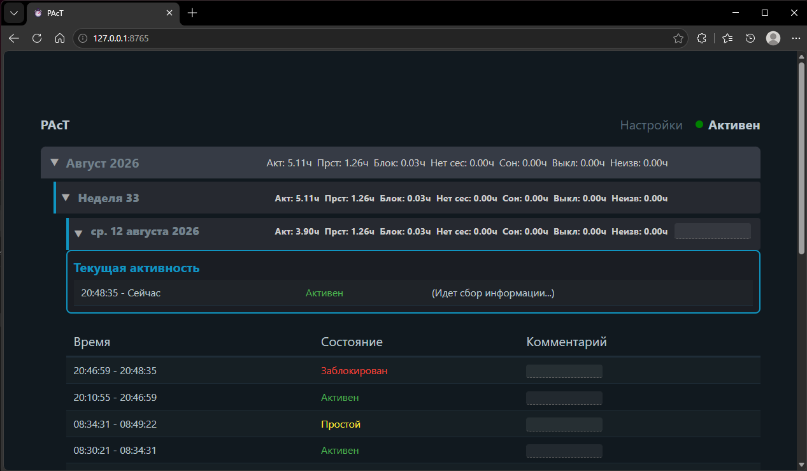
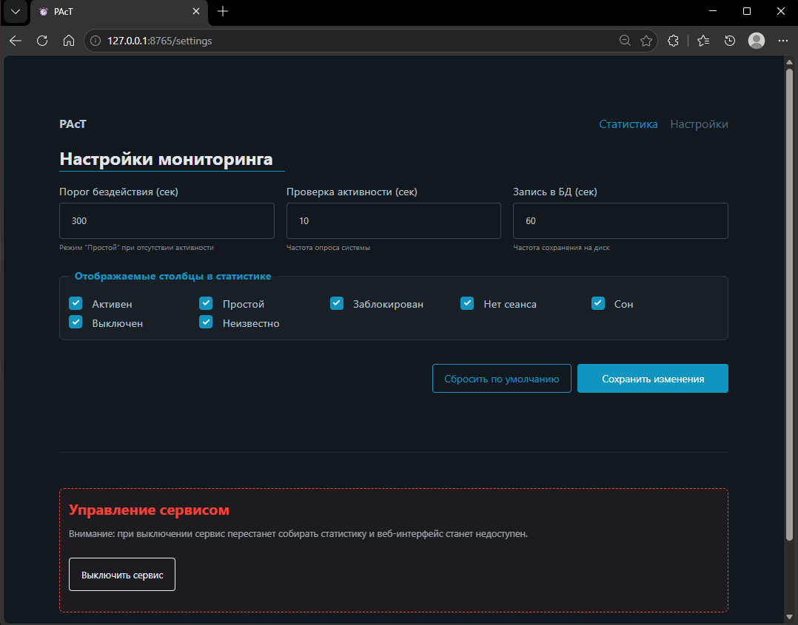

# PAcT (Personal Activity Tracker)

Локальный сервис для мониторинга активности пользователя в Windows с веб-интерфейсом.

## Функционал
- Отслеживание состояний: Активен, Простой, Заблокирован, Сон.
- **Мониторинг активных окон**: Запись заголовков окон и названий приложений, в которых работает пользователь.
- **Визуализация статистики**: Интерактивные диаграммы (Chart.js) и таблицы активности по приложениям за день, неделю или месяц.
- Веб-интерфейс на FastAPI + HTMX + PicoCSS (все зависимости локальные, работает без интернета).
- Настройка параметров через веб-интерфейс (порог бездействия, частота опроса, интервал сохранения, язык интерфейса).
- Хранение данных в локальной БД SQLite.
- Работает без внешних зависимостей (кроме Python библиотек) через WinAPI.

## Как запустить

### Из скомпилированного файла
1. Скопируйте файл `dist/PAcT.exe` в любую удобную папку.
2. Запустите его. Если Windows SmartScreen заблокирует запуск, нажмите "Подробнее" -> "Выполнить в любом случае".
3. После запуска откройте в браузере: `http://localhost:8765`
4. **(Опционально)** Добавьте сервис в автозагрузку (см. раздел [Автозагрузка](#автозагрузка-windows)).
   *Примечание: При использовании venv убедитесь, что вы запускаете `pythonw` из папки `venv\Scripts\`.*

### Из исходного кода
1. Установите Python 3.13 (рекомендуется).
2. Создайте и активируйте виртуальное окружение:
   ```powershell
   python -m venv venv
   .\venv\Scripts\activate
   ```
3. Установите зависимости:
   ```powershell
   pip install -r requirements.txt
   ```
4. Запустите сервис в фоне (без окна консоли):
   ```powershell
   pythonw main.py
   ```
5. Откройте в браузере: `http://localhost:8765`
6. **(Опционально)** Добавьте сервис в автозагрузку (см. раздел [Автозагрузка](#автозагрузка-windows)).

## Интерфейс
### Главная страница
Отображает статистику активности за текущий день и историю по дням.


### Настройки
Позволяют изменять параметры мониторинга и корректно выключать сервис.


## Логи и отладка
Если сервис работает некорректно или не запускается:
1. Проверьте файл `app.log` в папке приложения. Туда записываются все сообщения консоли и ошибки.
2. База данных с активностью хранится в `pact_db.db`.

## Как остановить
- **Через интерфейс:** Вкладка "Настройки" -> кнопка "Выключить сервис". Это самый безопасный способ (все данные гарантированно сохранятся).
- **Через консоль:** `Ctrl+C` (если запущен через `python`).
- **Диспетчер задач:** Завершите процесс `PAcT.exe` или `pythonw.exe`.

## Автозагрузка (Windows)

### Для Python-скрипта (без консоли)
Выполните команду в PowerShell от имени администратора, находясь в папке проекта (с активированным venv):
```powershell
$pythonPath = Join-Path (Get-Location) "venv\Scripts\pythonw.exe"; $scriptPath = Join-Path (Get-Location) "main.py"; New-ItemProperty -Path "HKCU:\Software\Microsoft\Windows\CurrentVersion\Run" -Name "PAcT_Monitor" -Value "`"$pythonPath`" `"$scriptPath`"" -PropertyType String -Force
```

### Для скомпилированного EXE
1. Нажмите `Win + R`, введите `shell:startup`.
2. Перетащите ярлык `PAcT.exe` в открывшуюся папку.

## Настройки
В веб-интерфейсе можно изменить:
- **Порог бездействия:** Время, после которого статус меняется на "Простой".
- **Частота проверки:** Как часто (в секундах) трекер опрашивает WinAPI.
- **Интервал сохранения:** Как часто данные из памяти записываются в `pact_db.db`.
- **Язык интерфейса:** Переключение между русским и английским языками.

## Сборка в автономный файл (.exe)
Для сборки используется PyInstaller. Полученный файл будет **полностью автономным**: для его запуска на других компьютерах с Windows **не требуется установка Python**. При этом приложение будет работать в фоновом режиме **без окна консоли**.

### Вариант 1: PyInstaller (стандартный)
1. Установите зависимости:
   ```bash
   pip install -r requirements.txt
   ```
2. Запустите сборку:
   ```bash
   pyinstaller build.spec
   ```

### Вариант 2: Nuitka (рекомендуемый для защиты и скорости)
Nuitka транслирует Python в C++, что дает прирост производительности и лучшую защиту от декомпиляции.

1. Установите зависимости:
   ```bash
   pip install -r requirements.txt
   ```
2. Запустите скрипт сборки:
   ```bash
   python build_nuitka.py
   ```
3. Результат будет в файле `dist/PAcT_nuitka.exe`.
   *Примечание: Первая сборка может занять 5-10 минут, так как Nuitka скачивает компилятор C++.*

## Разработка
- `TODO.md` — список планируемых задач и идей.
- `STATUSES_README.md` — подробное описание логики статусов.
- `tracker.py` — логика отслеживания (WinAPI).
- `db.py` — работа с SQLite (aiosqlite).
- `web.py` — API и веб-сервер (FastAPI).
- `templates/` — HTML шаблоны (Jinja2).
